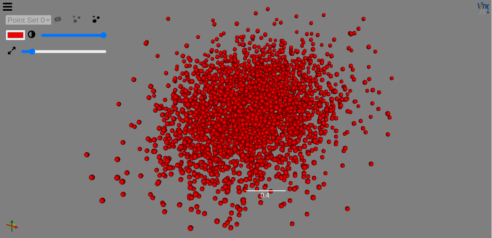
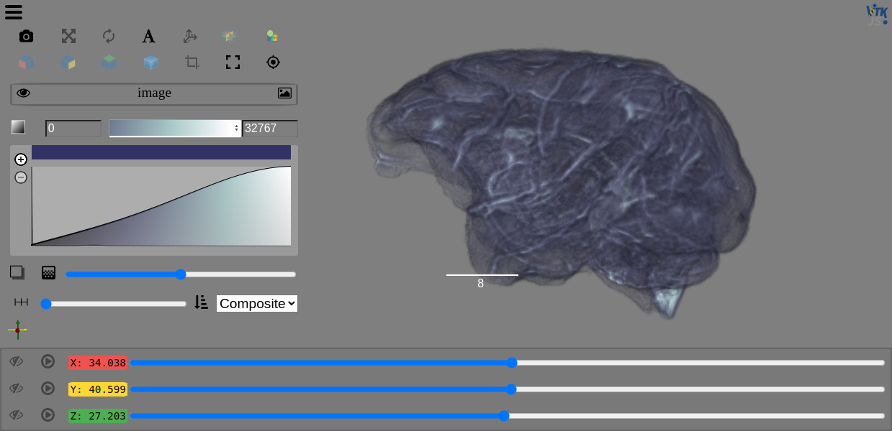
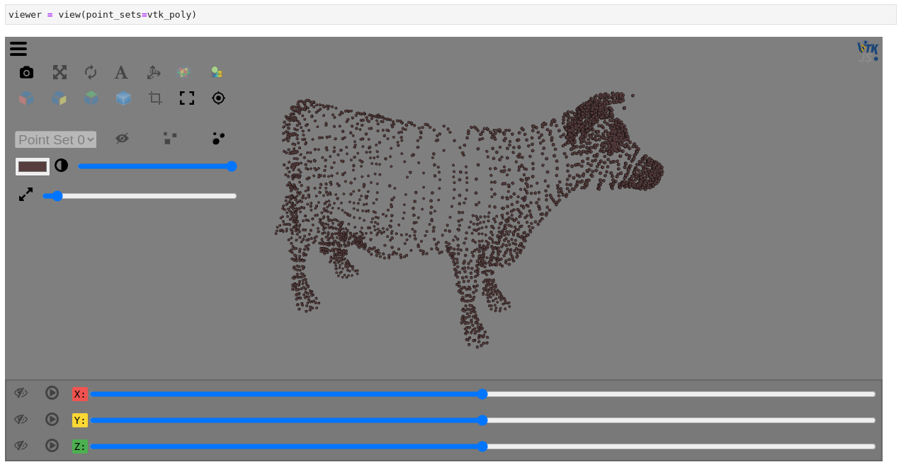
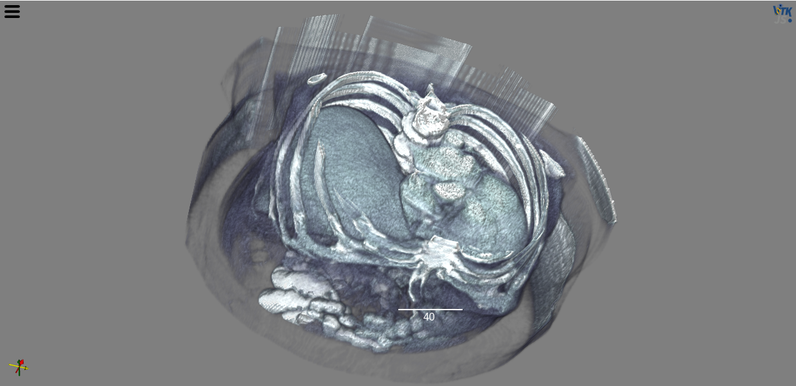
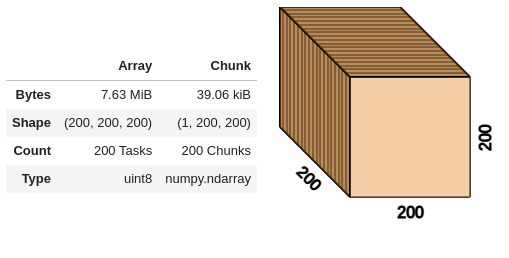
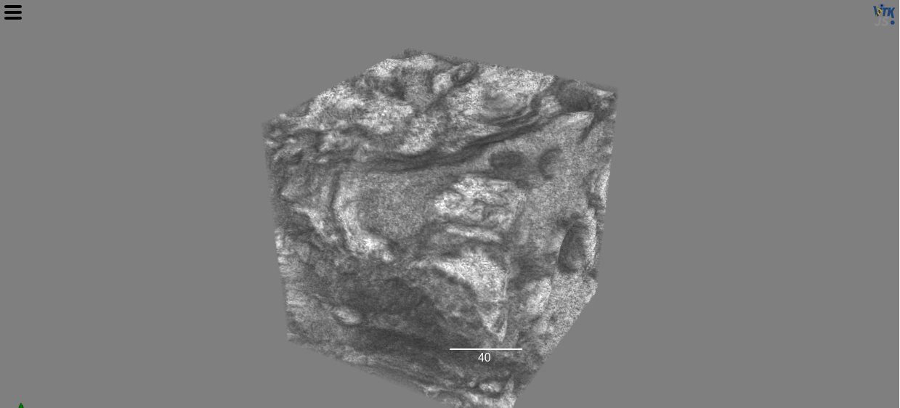
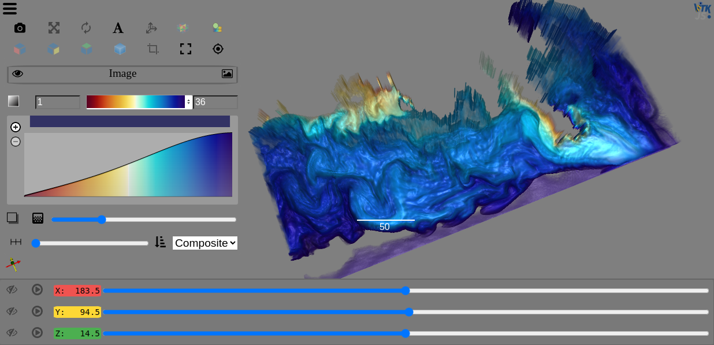
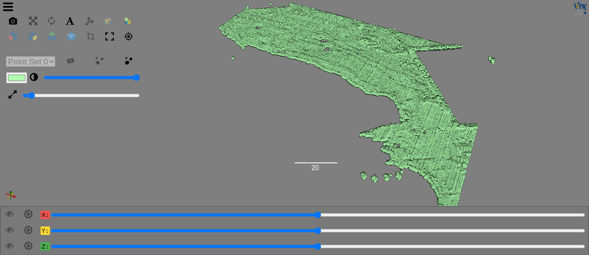
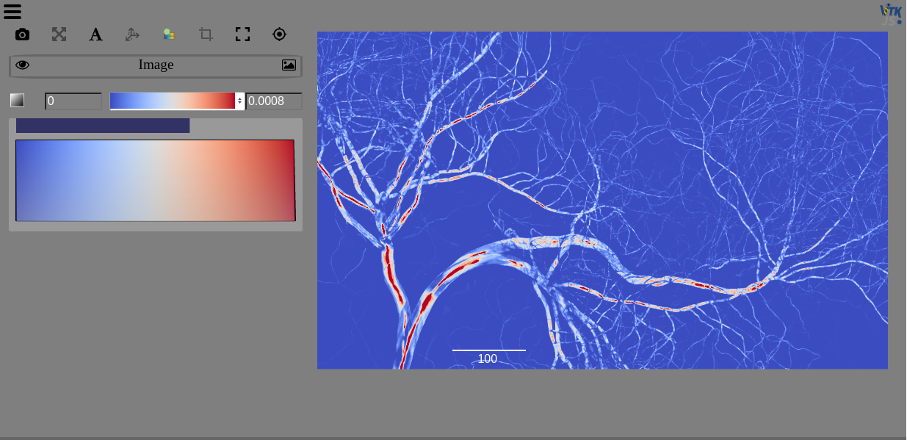
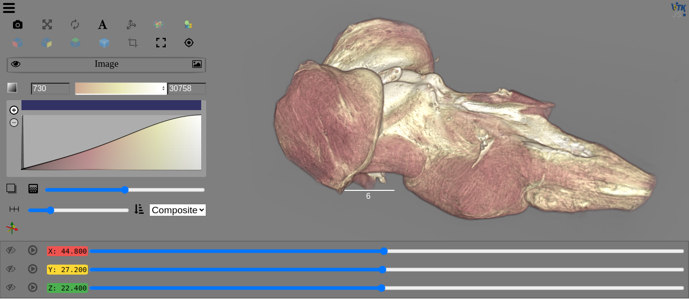

Integrations
============

NumPy
-----

Install NumPy:

```bash
pip install numpy
```

Or see the [NumPy docs](https://numpy.org/install/) for advanced installation options.

Use NumPy to build and view your data:

```python
import numpy as np
from itkwidgets import view

number_of_points = 3000
gaussian_mean = [0.0, 0.0, 0.0]
gaussian_cov = [[1.0, 0.0, 0.0], [0.0, 2.0, 0.0], [0.0, 0.0, 0.5]]
point_set = np.random.multivariate_normal(gaussian_mean, gaussian_cov, number_of_points)

view(point_set=point_set)
```

Or check out the [NumPyArrayPointSet](https://colab.research.google.com/github/InsightSoftwareConsortium/itkwidgets/blob/main/examples/NumPyArrayPointSet.ipynb) example notebook to try it out for yourself!



ITK
---

Install ITK:

```bash
pip install itk-io
```

You can use ITK to read in and filter your data before displaying and interacting with it with the Viewer.

```python
import os
import itk
from itkwidgets import view
from urllib.request import urlretrieve

# Download data
file_name = '005_32months_T2_RegT1_Reg2Atlas_ManualBrainMask_Stripped.nrrd'
if not os.path.exists(file_name):
    url = 'https://data.kitware.com/api/v1/file/564a5b078d777f7522dbfaa6/download'
    urlretrieve(url, file_name)

image = itk.imread(file_name)
view(image, rotate=True, gradient_opacity=0.4)
```

Get started with ITK in the [3DImage](https://colab.research.google.com/github/InsightSoftwareConsortium/itkwidgets/blob/main/examples/integrations/itk/3DImage.ipynb) notebook. You can also visit the [ITK docs](https://docs.itk.org/en/latest/learn/python_quick_start.html) for additional examples for getting started.



VTK
---

Install VTK:

```bash
pip install vtk
```

You can build you own VTK data or read in a file to pass to the Viewer.

```python
import os
import vtk
from itkwidgets import view
from urllib.request import urlretrieve

# Download data
file_name = 'vase.vti'
if not os.path.exists(file_name):
    url = 'https://data.kitware.com/api/v1/file/5a826bdc8d777f0685782960/download'
    urlretrieve(url, file_name)

reader = vtk.vtkXMLImageDataReader()
reader.SetFileName(file_name)
reader.Update()
vtk_image = reader.GetOutput()

viewer = view(vtk_image)
```

Please be sure to check out the extensive list of [Python VTK examples](https://kitware.github.io/vtk-examples/site/Python/) that are available for the majority of the available VTK classes, or jump right in with the [vtkImageData](https://colab.research.google.com/github/InsightSoftwareConsortium/itkwidgets/blob/main/examples/integrations/vtk/vtkImageData.ipynb) or [vtkPolyDataPointSet](https://colab.research.google.com/github/InsightSoftwareConsortium/itkwidgets/blob/main/examples/integrations/vtk/vtkPolyDataPointSet.ipynb) example notebooks.



MONAI
-----

MONAI is a PyTorch-based, open-source framework for deep learning in healthcare imaging. Get started by installing MONAI:

```bash
pip install monai
```

By default only the minimal requirements are installed. The extras syntax can be used to install optional dependencies. For example,

```bash
pip install 'monai[nibabel, skimage]'
```

For a full list of available options visit the [MONAI docs](https://docs.monai.io/en/stable/installation.html#installing-the-recommended-dependencies).

Check out the [transform_visualization](https://colab.research.google.com/github/InsightSoftwareConsortium/itkwidgets/blob/main/examples/integrations/MONAI/transform_visualization.ipynb) notebook for an example of visualize PyTorch tensors.



dask
----

Dask offers options for installation so that you include only as much or little as you need:

```bash
pip install "dask[complete]"    # Install everything
pip install dask                # Install only core parts of dask
pip install "dask[array]"       # Install requirements for dask array
pip install "dask[dataframe]"   # Install requirements for dask dataframe
```

See the [full documentation](https://docs.dask.org/en/stable/install.html#dask-installation) for additional dependency sets and installation options.

You can read in and visualize a dask array in just a few lines of code:

```python
import os
import zipfile
import dask.array.image
from itkwidgets import view
from urllib.request import urlretrieve

# Download data
file_name = 'emdata_janelia_822252.zip'
if not os.path.exists(file_name):
    url = 'https://data.kitware.com/api/v1/file/5bf232498d777f2179b18acc/download'
    urlretrieve(url, file_name)
with zipfile.ZipFile(file_name, 'r') as zip_ref:
    zip_ref.extractall()

stack = dask.array.image.imread('emdata_janelia_822252/*')

view(stack, shadow=False, gradient_opacity=0.4, ui_collapsed=True)
```

Try it yourself in the [DaskArray](https://colab.research.google.com/github/InsightSoftwareConsortium/itkwidgets/blob/main/examples/integrations/dask/DaskArray.ipynb) notebook.




xarray
------

Xarray uses labels (dimensions, coordinates and attributes) on top of raw data to provide a powerful, concise interface with operations like

```python
x.sum('time')
```

Xarray has a few required dependencies that must be installed as well:

```bash
pip install numpy     # 1.18 or later
pip install packaging # 20.0 or later
pip install pandas    # 1.1 or later
pip install xarray
```

Build your own xarray DataArray or Dataset or check out [xarray-data](https://github.com/pydata/xarray-data) for sample data to visualize.

```python
import numpy as np
import xarray as xr
from itkwidgets import view

ds = xr.tutorial.open_dataset("ROMS_example.nc", chunks={"ocean_time": 1})

view(ds.zeta, ui_collapsed=False, cmap="Asymmtrical Earth Tones (6_21b)", sample_distance=0)
```


The [DataArray](https://colab.research.google.com/github/InsightSoftwareConsortium/itkwidgets/blob/main/examples/integrations/xarray/DataArray.ipynb) notebook provides an example using the ROMS_example provided by xarray-data.



PyVista
-------

PyVista is Pythonic VTK, providing mesh data structures and filtering methods for spatial datasets and is easy to install and get started with:

```bash
pip install pyvista
```

The [Core API](https://docs.pyvista.org/api/core/index.html) provides an overview of the supported data types and the [examples](https://docs.pyvista.org/api/examples/_autosummary/pyvista.examples.examples.html#module-pyvista.examples.examples) module provides a nice selection of sample data that you can use
to get started.

The [UniformGrid](https://colab.research.google.com/github/InsightSoftwareConsortium/itkwidgets/blob/main/examples/integrations/PyVista/UniformGrid.ipynb) and [LiDAR](https://colab.research.google.com/github/InsightSoftwareConsortium/itkwidgets/blob/main/examples/integrations/PyVista/LiDAR.ipynb) notebooks demonstrate PyVista data being visualized with the Viewer.



PyImageJ
--------

PyImageJ provides a set of wrapper functions for integration between ImageJ2 and Python and the simplest way to install PyImageJ is with Conda because if you use pip you will need to manage the OpenJDK and Maven dependencies separately. See the [Conda docs](https://docs.conda.io/projects/conda/en/latest/user-guide/install/index.html) for installation on your system or follow
PyImageJ's suggestion of using Mamba ([install Mambaforge](https://github.com/conda-forge/miniforge#mambaforge)).

```bash
mamba create -n pyimagej pyimagej openjdk=8
```

For more detatiled installation instructions and alternativate options like pip, see the [PyImageJ installation docs](https://github.com/imagej/pyimagej/blob/master/doc/Install.md).


Run the ImageJImgLib2 notebook to see how we can load images and apply filters before viewing them in the Viewer.



Zarr
----

Zarr is a format for the storage of chunked, compressed, N-dimensional arrays that supports chunking arrays along any dimension, reading or writing arrays concurrently from multiple threads or processes, as well as organizing arrays into hierarchies via groups.

To install Zarr:

```bash
pip install zarr
```

You can use Zarr to read data stored locally or on S3, as we do in the [OME-NGFF-Brainstem-MRI](https://colab.research.google.com/github/InsightSoftwareConsortium/itkwidgets/blob/main/examples/integrations/zarr/OME-NGFF-Brainstem-MRI.ipynb) example notebook.

```python
from zarr.storage import FSStore

fsstore = FSStore('https://dandiarchive.s3.amazonaws.com/zarr/7723d02f-1f71-4553-a7b0-47bda1ae8b42')
brainstem = zarr.open_group(fsstore, mode='r')

view(brainstem)
```


